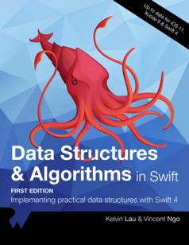

# 翻译：Swift Algorithm Club: Boyer Moore String Search Algorithm


来自：[Swift Algorithm Club: Boyer Moore String Search Algorithm](https://www.raywenderlich.com/541-swift-algorithm-club-boyer-moore-string-search-algorithm)

---
学习如何在Swift中使用Boyer Moore算法搜索字符串。

[Swift Algorithm Club](https://github.com/raywenderlich/swift-algorithm-club)是一个在Swift中实现数据结构和算法的开源项目。

每个月，[Vincent Ngo](https://www.raywenderlich.com/u/jomoka), [Ross O 'Brien](https://www.raywenderlich.com/u/narrativium)和我都会在这个网站的教程中介绍一个来自俱乐部的很酷的数据结构或算法。

在这个教程中，你将会分析2个算法：

1. [Matthijs Hollemans](https://github.com/hollance) 的[蛮力](https://github.com/raywenderlich/swift-algorithm-club/tree/master/Brute-Force%20String%20Search)字符串搜索
2. 由[Matthijs Hollemans](https://github.com/hollance)设计的[Boyer Moore](https://github.com/raywenderlich/swift-algorithm-club/tree/master/Boyer-Moore)字符串搜索

> **NOTE**
> 这是为Xcode 9Beta 2/Swift 4编写的。你可以在[这里](https://developer.apple.com/download/)下载Xcode beta。
> 
## 开始
说明字符串搜索算法在世界上有多么重要是相当简单的。按下`CMD` + `F`，试着搜索字母`c`。你会立即得到结果。现在想象一下，如果计算这个花费了10秒钟，那么您最好退休!

## 对它使用蛮力！
蛮力法相对简单。要理解蛮力字符串方法，请考虑字符串“HELLO WORLD”:


对于本教程的目的，有几件事需要记住。

1. 你的搜索算法应该区分大小写。
2. 该算法应该返回第一个匹配项的索引。
3. 部分匹配应该有效。例如：

```swift
let text = "HELLO WORLD"
text.index(of: "ELLO") // returns 1
text.index(of: "LD") // returns 9

//in Swift 5
//'encodedOffset' is deprecated: encodedOffset has been deprecated as most common usage is incorrect. Use utf16Offset(in:) to achieve the same behavior.
text.range(of: "ELLO")?.lowerBound.encodedOffset // 1
//或者
text.range(of: "ELLO")?.lowerBound.utf16Offset(in: "ELLO")  // 1
//或者
text.range(of: "LD")?.lowerBound.utf16Offset(in: "") // 9
//或者
NSString(string: text).range(of: "WORLD").location // 6
```
> 参考自：
> 1. [string – 如何在Swift中将“Index”转换为“Int”类型？](http://www.voidcn.com/article/p-rslmmqbu-btg.html)
> 2. [NSString的查找字符串位置和截取字符串](https://blog.csdn.net/howlaa/article/details/51451685)


算法相当简单。例如，假设您正在寻找样模式“LO”。首先遍历源字符串。一旦找到与查找字符串的第一个字符匹配的字符，就会尝试匹配其他字符。否则，您将继续匹配其余的字符串:

<iframe height=168 width=778 src="./Images/2.gif"></iframe>
### 实现

你将把这个方法写出`String`的`extension`。用Xcode 9 beta 2或更高版本，创建一个新的Swift playground。删除样板代码，这样您就有了一个空白的playground页面。首先在`String`扩展内创建实现的存根（stub）。在你的playground的顶部写下下面的内容：

```swift
extension String {
  func index(of pattern: String) -> Index? {
    // more to come
    return nil
  }
}
```
这个函数的目的很简单:给定一个字符串(这里称为**源字符串**)，检查它是否包含另一个字符串(这里称为**模式**)。如果可以进行匹配，它将返回匹配的第一个字符的索引。如果这个方法找不到匹配项，它将返回`nil`。

从Swift 4开始，`String`暴露了 `indices` 属性，该属性包含用于下标字符串的所有索引。您将使用它来遍历源字符串。更新函数如下:

```swift
func index(of pattern: String) -> Index? {
  // 1
  for i in indices {

    // 2
    var j = i
    var found = true
    for p in pattern.indices {
      guard j != endIndex && self[j] == pattern[p] else { found = false; break }
      j = index(after: j)
    }
    if found {
      return i
    }
  }
  return nil
}
```
这正是你想要的：

1. 循环源字符串的索引。
2. 尝试将模式字符串与源字符串匹配。

一旦找到匹配项，就会返回索引。是时候进行测试了。在你的playground底部写下以下内容:

```swift
let text = "Hello World"
text.index(of: "lo") // returns 3
text.index(of: "ld") // returns 9

//in Swift 5
text.index(of: "lo")?.utf16Offset(in: "") // returns 3
text.index(of: "ld")?.utf16Offset(in: "") // returns 9
```
蛮力方法是有效的，但它的效率相对较低。在下一节中，您将了解如何使用一种巧妙的技术来优化算法。

## Boyer Moore字符串搜索
事实证明，您不需要查看源字符串中的每个字符—您通常可以跳过多个字符。跳前(skip-ahead)算法被称为`Boyer Moore`，它已经存在一段时间了。它被认为是所有字符串搜索算法的基准。

这项技术建立在蛮力法的基础上，有两个关键的区别:

1. 模式匹配是向后进行的。
2. 在遍历期间使用跳过表(skip table)来执行主动跳过

它是这样的:

<iframe height=343 width=889 src="./Images/3.gif"></iframe>
Boyer Moore技术利用了跳跃表(skip table)。这个想法很简单。您可以根据要匹配的单词创建一个表。该表负责保存单词的给定字母可以跳过的步骤数。下面是单词`“HELLO”`的跳跃表:


您将使用跳过表来决定应该向前跳过多少遍历。在每次遍历源字符串之前，您将查阅跳过表。为了说明这个用法，我们来看一个具体的例子:


在这种情况下，比较源字符串中的`“H”`字符。由于这与模式中的最后一个字符不匹配，您将希望向下移动源字符串。在此之前，您可以参考跳过表，看看是否有机会进行一些跳过。在本例中，“H”位于跳过表中，您可以执行4索引跳过。

回到你的Swift playground，删除`index(of:)`的实现，除了`return nil`:

```swift
func index(of pattern: String) -> Index? {
  return nil 
}
```

## 跳过表
您将从处理跳过表开始。在`String`的`extension`中写入以下内容:
```swift
fileprivate var skipTable: [Character: Int] {
  var skipTable: [Character: Int] = [:]
  for (i, c) in enumerated() {
    skipTable[c] = count - i - 1
  }
  return skipTable
}
```
这将枚举一个字符串，并返回一个字典，其中的字符作为键，一个整数表示(representing)它应该跳过的数量。验证它是否工作。在你的playground底部写下以下内容:
```swift
let helloText = "Hello"
helloText.skipTable.forEach { print($0) }
```

您应该在控制台中看到以下内容:
```swift
(key: "H", value: 4)
(key: "L", value: 1)
(key: "O", value: 0)
(key: "E", value: 3)
```
这与前面的表格图(table diagram)相匹配。

## 匹配
Boyer Moore算法的另一个组成部分是反向字符串匹配。你会想出一个方法来处理它。这种方法有三个目标:

1. 反向匹配两个字符串的字符。
2. 如果在任一点匹配失败，方法将返回`nil`。
3. 如果匹配成功，返回匹配模式第一个字母在源字符串中的`String.Index`。

在`skipTable`的下面写下以下内容：
```swift
// 1
fileprivate func match(from currentIndex: Index, with pattern: String) -> Index? {
  // more to come

  // 2
  return match(from: index(before: currentIndex), with: "\(pattern.dropLast())")
}
```

这是一个你可以用它来匹配源字符串和模式字符串的递归方法：

1. `currentIndex`跟踪要匹配的源字符串的当前字符。
2. 在每次递归调用中，都要递减索引，并通过删除模式字符串的最后一个字符来缩短模式字符串。

这个方法的行为像这样的:

<iframe height=357 width=566 src="./Images/6.gif"></iframe>
现在，是时候处理比较逻辑了。将匹配方法更新为:
```swift
fileprivate func match(from currentIndex: Index, with pattern: String) -> Index? {
  // 1
  if currentIndex < startIndex { return nil }
  if currentIndex >= endIndex { return nil }
  
  // 2
  if self[currentIndex] != pattern.last { return nil }

  // 3
  if pattern.count == 1 && self[currentIndex] == pattern.last { return currentIndex }
  return match(from: index(before: currentIndex), with: "\(pattern.dropLast())")
}
```

1. 你需要做一些边界检查。如果`currentIndex`超出了界限，您将返回`nil`
2. 如果字符不匹配，则没有必要继续。
3. 如果`pattern`中的最后一个字符匹配，那么您将返回当前索引，说明匹配是在这个位置开始的。

> 为了便于解释，我将逻辑分成了多个语句。你可以用`guard`以更简洁的方式重写:
> ```swift
> guard currentIndex >= startIndex && currentIndex < endIndex && pattern.last == self[currentIndex] 
  else { return nil }
if pattern.count == 1 && self[currentIndex] == pattern.first { return currentIndex }
> ```
> 
跳过表和匹配函数都准备好了，是时候处理the final piece of the puzzle(最后一块拼图)了!

## `index(of:)`

更新`index`方法为下面的内容：
```swift
func index(of pattern: String) -> Index? {
  // 1
  let patternLength = pattern.count
  guard patternLength > 0, patternLength <= count else { return nil }

  // 2
  let skipTable = pattern.skipTable
  let lastChar = pattern.last!

  // 3
  var i = index(startIndex, offsetBy: patternLength - 1)
  
  // more to come...
  return nil
}
```
你已经建立了一个竞技场：
1. 首先，检查模式字符串的长度是否在源字符串的范围内。
2. 跟踪模式字符串的跳过表，和它的最后一个字符。
3. 您将初始化一个 `String.Index` 来跟踪遍历。因为你计划向后匹配字符串，所以你可以用模式的长度来抵消这个索引，这样你就有了一个小的开端。

接下来，您将定义匹配和遍历的逻辑。在`return`语句之前添加以下内容:
```swift
// 1
while i < endIndex {
  let c = self[i]

  // 2
  if c == lastChar {
    if let k = match(from: i, with: pattern) { return k }
    i = index(after: i)
  } else { 
    // 3
    i = index(i, offsetBy: skipTable[c] ?? patternLength, limitedBy: endIndex) ?? endIndex
  }
}
```

Here's the play by play：以下是每一步的解释：
1. 你将继续遍历源字符串，直到到达`endIndex`。
2. 如果源字符串的当前字符与模式字符串的最后一个字符匹配，您将尝试运行`match`函数。如果返回非`nil`值，则表示找到了匹配项，因此将返回与模式匹配的索引。否则，将移动到下一个索引。
3. 如果你无法匹配，你将查阅skip表，以查看可以跳过多少索引。如果这个跳过超出了源字符串的长度，你将直接跳到末尾。

是时候试一试了（Time to give it a whirl.）。在playground底部添加以下内容：
```swift
let sourceString = "Hello World!"
let pattern = "World"
sourceString.index(of: pattern)

//in Swift 5
if let index = sourceString.index(of: pattern) {
    let intValue = sourceString.distance(from: sourceString.startIndex, to: index)
    print(intValue)  // 6
}
//或者
if let index = sourceString.index(of: pattern) {
    print( index.utf16Offset(in: "")) // 6
}
```
你应该得到6的索引。Woohoo，它工作了！

## Where to go From Here?

我希望您喜欢这篇关于高效字符串搜索的教程!

这是一个带有上述代码的[playground](https://koenig-media.raywenderlich.com/uploads/2017/06/BoyerMoore.playground-1.zip)。您还可以找到原始实现，并进一步讨论了[蛮力字符串搜索](https://github.com/raywenderlich/swift-algorithm-club/tree/master/Brute-Force%20String%20Search)和[Boyer Moore字符串搜索](https://github.com/raywenderlich/swift-algorithm-club/tree/master/Boyer-Moore)的repo。

这只是Swift Algorithm Club知识库中的众多算法之一。如果你对更多感兴趣，请查看[repo](https://github.com/raywenderlich/swift-algorithm-club)。

了解算法和数据结构最符合你的兴趣——它们是许多现实问题的解决方案，并且经常作为面试问题被问到。Plus it's fun!

所以，请继续关注Swift Algorithm Club未来的更多教程。同时，如果您对在Swift中实现树有任何问题，请加入下面的论坛讨论。

> **NOTE**： Swift Algorithm Club一直在寻找更多的贡献者。如果你有一个有趣的数据结构、算法，甚至是一个面试问题要分享，不要犹豫去贡献自己的一份！要了解更多关于贡献过程的信息，请查看我们[Join the Swift Algorithm Club](https://www.raywenderlich.com/135533/join-swift-algorithm-club)的文章。
> 

[](https://store.raywenderlich.com/products/data-structures-and-algorithms-in-swift)

If you enjoyed what you learned in this tutorial, why not check out [our Data Structures and Algorithms in Swift book](https://store.raywenderlich.com/products/data-structures-and-algorithms-in-swift), available on our store?

In Data Structures and Algorithms in Swift, you’ll learn how to implement the most popular and useful data structures and when and why you should use one particular datastructure or algorithm over another. This set of basic data structures and algorithms will serve as an excellent foundation for building more complex and special-purpose constructs.

As well, the high-level expressiveness of Swift makes it an ideal choice for learning these core concepts without sacrificing performance.


1. You’ll start with the fundamental structures of linked lists, queues and stacks, and see how to implement them in a highly Swift-like way.
2. Move on to working with various types of trees, including general purpose trees, binary trees, AVL trees, binary search trees and tries.
3. Go beyond bubble and insertion sort with better-performing algorithms, including mergesort, radix sort, heap sort and quicksort.
4. Learn how to construct directed, non-directed and weighted graphs to represent many real-world models, and traverse graphs and trees efficiently with breadth-first, depth-first, Dijkstra’s and Prim’s algorithms to solve problems such as finding the shortest path or lowest cost in a network.
5. And much, much more!

By the end of this book, you’ll have hands-on experience solving common issues with data structures and algorithms — and you’ll be well on your way to developing your own efficient and useful implementations.

---
[完]
